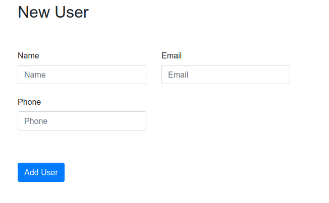
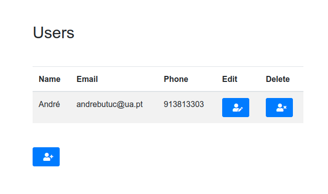
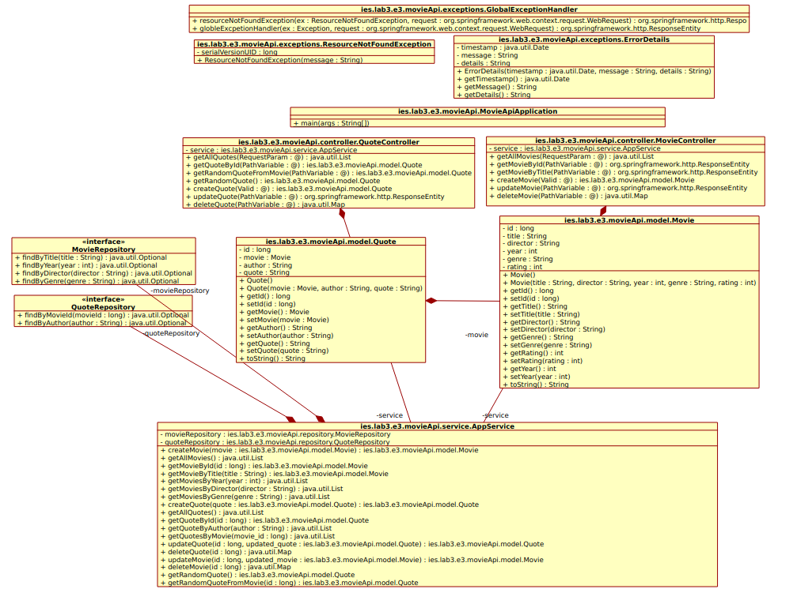
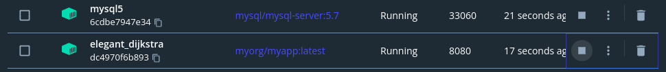
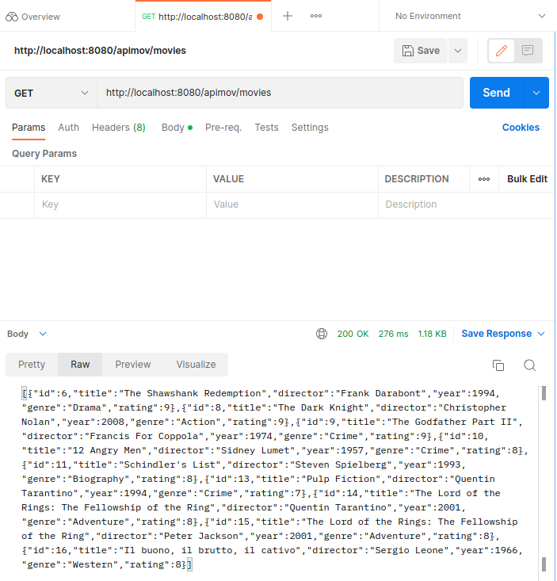

# Lab3 Notebook

## Author

**André Gabriel Butuc, Nmec: 103530, IES P1, 2022**

&nbsp;

## 3.1 Accessing databases in SpringBoot

**What is JPA?** 
The Jakarta Persistence API is concerned with persistence, which loosely means any mechanism by which Java objects outlive the application process that created them.

JPA defines a set of concepts that guide implementers. 

The core idea behind JPA as opposed to JDBC, is that for the most part, JPA lets you avoid the need to "think relationally". In JPA, you define your persistence rules in the real of Java code and objects.

&nbsp;

**b) Questions**:

- The new repository is instantiated through the UserController constructor with the use of the @Autowired notation which informs Spring Boot that it needs to instantiate the repository.

- The userRepository objects invokes the following methods:
  - findAll()
  - save()
  - findById
  - orElseThrow
  - delete
  
These methods are defined in the CrudRepository class of the org.spring.framework.data.repository;

- The data is being saved in memory, which isn't persistent.
  
- The rule for the "non empty" email address is defined in the javax's validation constaints "Not Blank" class which we use in the User.java file with the anotation @NotBlank before declaring the "email" attribute. 

&nbsp;

**c) Addition Printscreen**

&nbsp;



&nbsp;



&nbsp;

## 3.2 Multilayer applications: exposingdata with RESTinterface
&nbsp;

In this exercise I followed the tutorial step-by-step and didn't have much to note about.

&nbsp;

## 3.3 Wrapping-up and integrating concepts


In this exercise I created a RESTFul API of Movies and QUotes. The final product was the following:



As we can see in the diagram the project was divided into:
- Controllers
- Exceptions
- Models
- Repositories
- Service

Regarding the Models created, these consist on the two entities of the API, namely: Movie and Quote. Each entity had its own Repository and Controller.

**Extra Service Layer**

The main difference between this exercise and the previous exercise resides on the decoupling of the business logic from the Controllers. In order to achieve this, an extra layer, named AppService, was created to process the business logic behind the requests. In the AppService file there are two Autowired instances of the entities repositories.

With this decoupling, the Controllers now only process the incoming Requests and call the methods of a Autowired AppService object.

**Many-to-One Entity Relation**

Another difference from this exercise and the previous one is having to deal with two entities and additionally, having to deal with a Many-To-One relation between them.

This translated into using a personally never-used notation called @ManyToOne and @JoinColumn.

Going more in deep:
- The [@ManyToOne notation](https://docs.oracle.com/javaee/5/api/javax/persistence/ManyToOne.html) defines a single-valued association to another entity class that has many-to-one multiplicity. 
- The [@JoinColum notation](https://docs.oracle.com/javaee/5/api/javax/persistence/JoinColumn.html) it commonly used after the @ManyToOne notation to specify a mapped coumn for joining an entity association. In other words, it allows to reference the ID of another table entry of a different table (and class) as a foreign key.

**Using the Optional Tag**

In the previous exercise I did, as the tutorial guide instructed, a customized Exception and a GlobalExceptionHandler. However, the repository method which triggered such possible exception was already defined within the CRUD's extended interface (findById). Since in this exercise I needed to declare more search queries I had to look into what these queries needed to return in order to be handled by the GlobalExceptionHandler, if needed be. Here is where the `<Optional>`  tag enters.

The tag allows the use of methods which depend on the presence or absence of a contained value. For example, `.orElse()` that I used to throw the Exception (this methods returns a default value if no value is present). There for, the `<Optional>` tag value simply signals a container object which may or may not contain a non-null value.

### Final Comments on the development of the API

In general, this final exercise made me re-interpret and look into more detail regarding the structure of a RESTful API, specifically the Controller, Repository and Service layers.

For example, in the Controller I had to search what an [EntityResponse](https://docs.spring.io/spring-framework/docs/current/javadoc-api/org/springframework/http/ResponseEntity.html) was, in the Repository the meaning of the [Optional](https://docs.oracle.com/javase/8/docs/api/java/util/Optional.html) Tag and in the Service the specific returned values which were needed by the Controler.

&nbsp;

**Initial Struggles with Docker**

For this exercise the part where I mostly struggled was deploying the RESTful API in a docker container. Due to the standalone MySQL5 database docker container dependency I had to create my own docker network:

```
docker network create -d bridge my-network
```

Afterwards I added the existant MySQL5 database (named mysql5) to the my-network docker network:

```
docker network connect my-network mysql5
```

The next part was also tricky, in order to create a docker image and then build a container from it, I had to do the following adaptations to the code:

*pom.xml, inside the build tag*
```xml
<plugin>
				<groupId>org.apache.maven.plugins</groupId>
				<artifactId>maven-compiler-plugin</artifactId>
				<configuration>
					<failOnError>false</failOnError>
				</configuration>
</plugin>
```

I had to make the compiler ignore compilation errors due to the following adaptation:

*application.properties*
```
spring.datasource.url=jdbc:mysql://mysql5/demo?enabledTLSProtocols=TLSv1.2
```

By altering the URL path of the datasource to the actual docker container this wouldn't work locally because the app wouldn't recognize the host. However, this change was essential for the API to run inside the docker container side-by-side with the MySQL container.

After all these adaptations, the program finally compiled and generated the .JAR file I wanted.

*Generation of the .JAR snapshot*
```shell
./mvnw install
```
After having the .JAR snapshot I created a Dockerfile and ran the following command to create the docker image:

```shell
docker build --build-arg JAR_FILE=target/*.jar -t myorg/myapp .
```

This command generated the image:
```shell
sha256:821cce06fda3f6c71d5bfa06c8cf34380efcea4d051b9c71afe505fc813d6db7
```

This command created the container from the image:
```shell
docker run -d -p 8080:8080 sha256:821cce06fda3f6c71d5bfa06c8cf34380efcea4d051b9c71afe505fc813d6db7
```

Afterwards I connected the created container to the my-network network (the name of the container was autogenerated by docker):
```docker network connect my-network elegant_dijkstra
```

Then I just started both containers with the help of Docker Desktop and was able to make Requests using Postman:





After all the previous steps and a lot of additional research on StackOverFlow and Docker documentation I was able to get rid of the error:

```
com.mysql.cj.jdbc.exceptions.CommunicationsException: Communications link failure
```

Which was caused by not having the two containers running in the same docker network and having the datasource URL in the application.properties pointing to the IPv4 address of the MySQL container and not to the actual container.

**!! Important note !! After doing every step mentioned above and having the API deployed in docker, I removed the made adaptations for the app to work properly on my computer.**

&nbsp;

## Review Questions

&nbsp;

### A) Explain the differences between the RestController and Controller components used in different parts of this lab.

&nbsp;

The differences between the RestController and Controller components are:

- @Controller is used to mark classes as Spring MVC Controller. @RestController annotation is a special controller used in RESTful web services, and it's the combination of @Controller and @ResponseBody annotation;
- @Controller is a specialized version of @Component annotation, whereas @RestController is a specialized version of @Controller annotation;
- In @Controller, we can return a view in Spring Web MVC, whereas in @RestController, we can not return a view;
- @Controller annotation indicates that the calss is a "controller" like a web controller. The @RestController annotation indicates that class is a controller where @RequestMapping methods assume @ResponseBody semantics by default;
- In @Controller, we need to use @ResponseBody on every handler method, whereas in @RestController, we don't need to use @ResponseBody on every handler methods;
- @Controller is older than @RestController.

&nbsp;

### B) Create a visualization of the Spring Boot layers (UML diagramor similar), displaying the key abstractions in the solutionof 3.3, in particular: entities, repositories, servicesand REST controllers.Describe the role of the elements modeled in the diagram.

&nbsp;

Diagram:


Roles:
- **Entities**: Entities allow to represent concepts in the form of Java classes. These classes help to structure the database model through the use of specific anotations, such as, @Table, @Id etc. Entities are the core of a RESTful API.
- **Repositories**: Repositories consist of an important connective layer to the actual database. They simplify and automatically generate important queries from simple java methods declaration.
- **Service**: The service layer is very important in order to decouple the business logic from the Controllers. It is in this layer that all the logic behind the "POST", "PUT", "GET" and "DELETE" request is made.
- **Controller**: The Controller recieves and handles the requests, validating the URL parameters and variables and invoking the Service's methods. 
- **Exception Handler and Exceptions**: The Exception Handler allows to throw Exceptions.

&nbsp;

### C) Explain the annotations @Table, @Colum, @Id found in the Employee entity.

&nbsp;

The **@Table anontation** allows us to specify the details of the table that will be used to persist the entity in the database. The @Table annotation provides four attributes, allowing us to override the name of the table, its catalog, and its schema, and enforce unique constrains on columns in the table.

The **@Column annotation** is used for adding the column with the given name in the table of a particular MySQL database.

The **@Id notation** is inherited from javax.persistence.Id, indicating the member field below is the primary key of the current entity.

&nbsp;

### D) Explain the use of the annotation @AutoWired (in the Rest Controller class).

&nbsp;

First it is important to understand what autowiring in Spring means. Autowiring is a feature of spring framework which enables us to inject the object dependencies implicitly. It internally uses setter or constructor injection.

The @Autowired annotation provides more fine-grained control over where and how autowiring should be accomplished.
