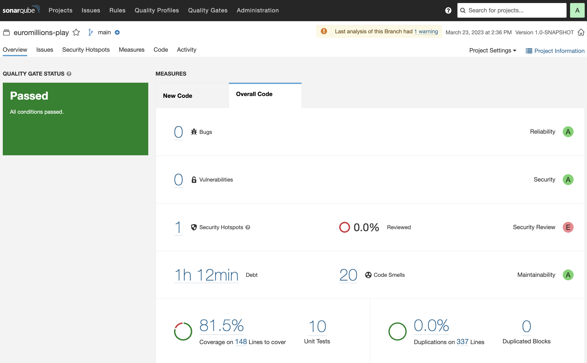
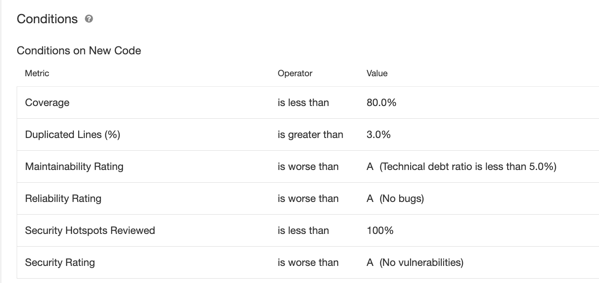

## Exercise 1 - Notebook

### Sonar Analysis

**f) Has your project passed the defined quality gate?**

My project has indeed passed the defined quality gate, having been graded A for Reliability,
Security and Maintainability, but only E in the Security Review. 
The project had 20 Code Smells which would take 1h12m to fix. 
My 10 unit tests covered a total of 81,5% of the code and I had 0% of code duplications.

The analysis ran with the Sonar default quality gate that has as "acceptance conditions":

**g) Explore the analysis results and complete with a few sample issue, as applicable.**

| Issue              | Problem Description                                                                                                                                                                                            | How to solve                                                                                                                                                                                                                                                    |
|--------------------|----------------------------------------------------------------------------------------------------------------------------------------------------------------------------------------------------------------|-----------------------------------------------------------------------------------------------------------------------------------------------------------------------------------------------------------------------------------------------------------------|
| Bug                | N.A.                                                                                                                                                                                                           | N.A                                                                                                                                                                                                                                                             |
| Vulnerability      | N.A                                                                                                                                                                                                            | N.A                                                                                                                                                                                                                                                             |
 | Code smell (major) | a) "Invoke method(s) only conditionally. Preconditions and logging arguments should not require evaluation."  b) "Refactor the code in order to not assign to this loop counter from within the loop body." | a) Invoke a method and assign its return value to a variable, make an if condition to evaluate its value and assure that it is different from _null_ before passing it as a paramater in the log method.  b) Instead of using a for loop, use a while loop. |

