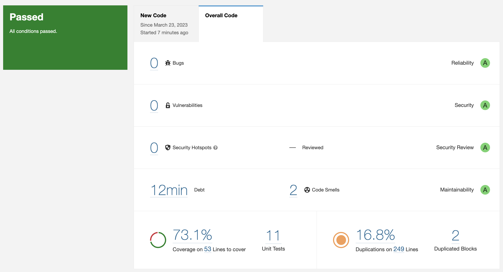
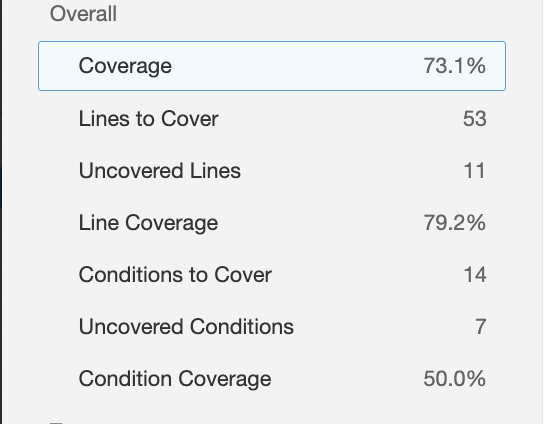

# Exercise 2 - Notebook

**a)**

The technical debt is equal to 12 minutes, which means that it would take me 12 minutes to fix
the 2 code smells that were identified.

**b)** No severe code smells were reported.

**d)** There are 11 uncovered lines and 7 uncovered conditions.

