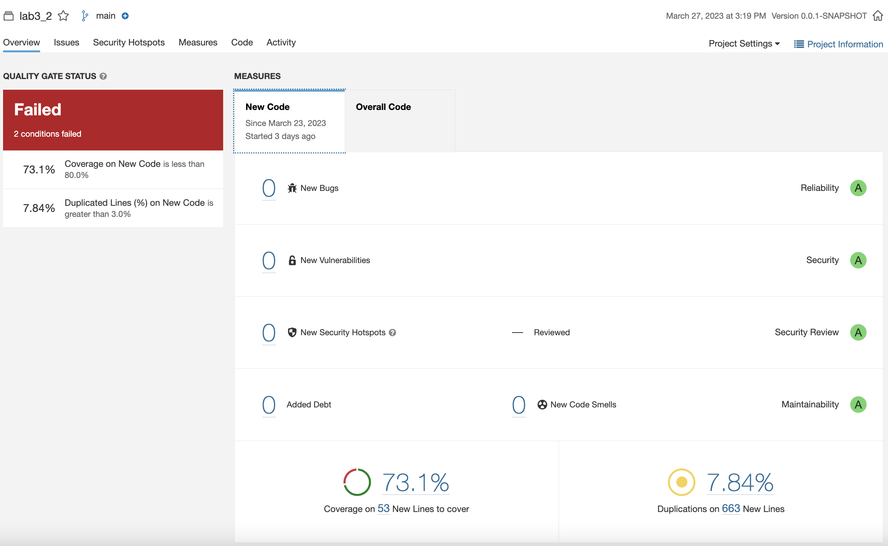
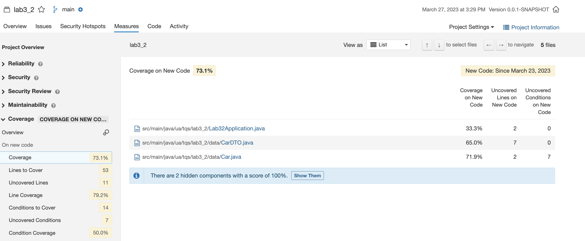
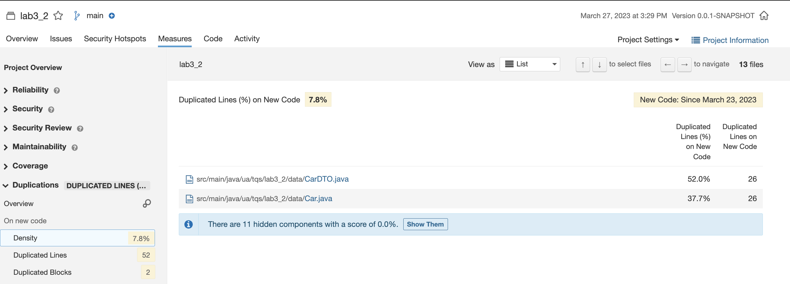
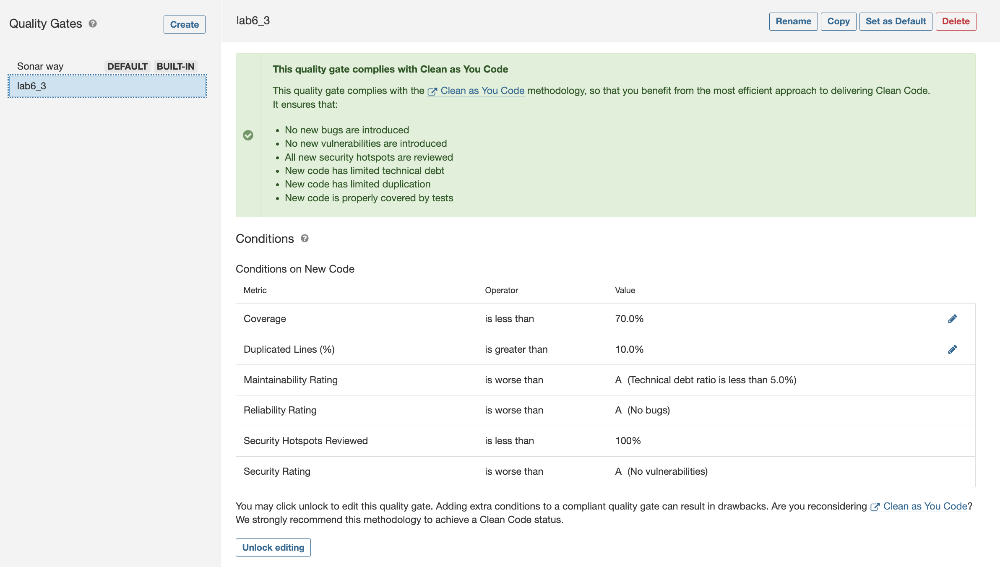
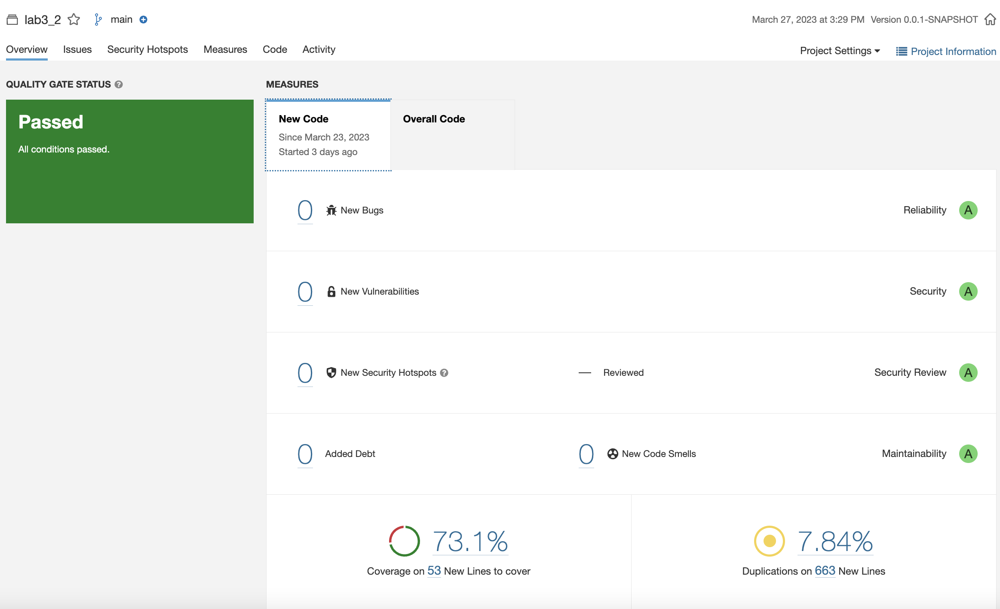

# Exercise 3 - Notebook

I am reusing the project from the previous exercise since I realised that it failed when I re-ran the analysis.

The sonarqube analysis pointed out that the new code was failing in two conditions of the default quality gate:

The two failing conditions were:
- "Coverage on New Code is less than 80.0%"
- "Duplicated Lines (%) on New Code is greater than 3.0%"

When finding out more details of what was causing the conditions to fail, I realised that the two conditions pointed to
the same code, namely CarDTO.java and Car.java. Since these two files are the same thing, but the CarDTO is an 
abstraction so that the API can't expose the inner structure of its entities, the quality gate should allow these
situations to pass the conditions.

Therefore, I created a new quality gate named "lab6_3", where I decreased the coverage percentage from 80% to 70% and
the duplicated lines percentage from 3% to 10%, in order to properly analyse the given project.

Now, the New Code passes the custom quality gate and will still identify poor practices in a proper way.

